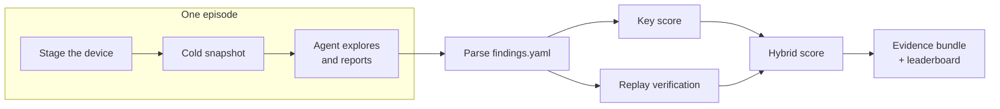
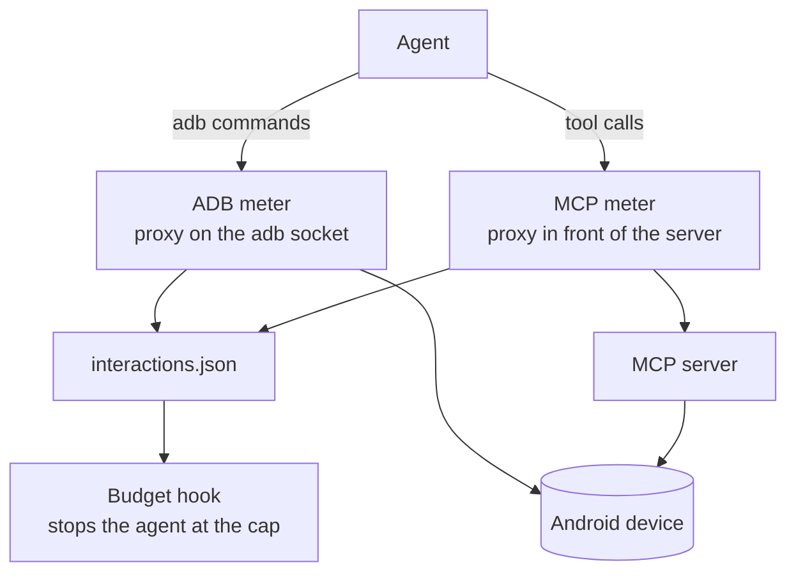
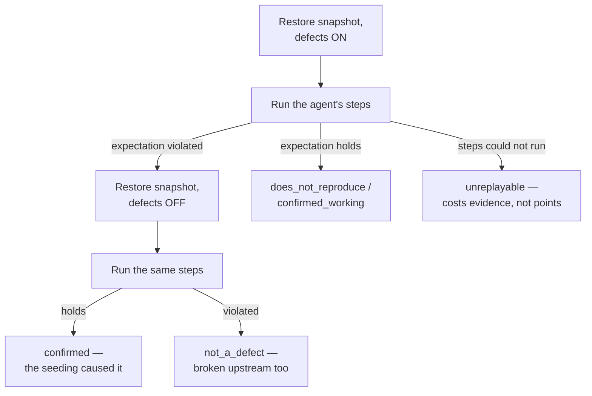

# Architecture — how the benchmark works

QualGentBench answers one question: **how good is a coding agent at real mobile QA?**
To answer it fairly, the harness has to do three jobs: hand every agent the exact same
world, measure the agent's work without trusting the agent, and verify every claim by
re-executing it. This document walks through the machinery that does that.

## The big picture

One **episode** = one agent, one model, one app, one trial. The agent gets a neutral
"sign off on this release" brief listing the app's feature areas — never a hint that
anything is broken. It explores the app on a real device, reports each area as
`as_specified` / `deviates` / `blocked` in `findings.yaml`, and writes a replayable
reproduction for every claim. Then the harness checks its work.

## The apps: real code, seeded defects

Every app is a real open-source Android app rebuilt with known defects patched into
its source. Each patch is gated on a runtime flag, so **one APK serves as both the
clean build and the seeded build** — the harness writes a flags file into the app's
sandbox to choose which defects are live.

Crucially, what counts as "broken" is **derived, never asserted**:
`scripts/derive_truth.py` runs every area's check against the clean flags and the
seeded flags and records what actually differs. Areas a defect breaks incidentally
become `collateral` (never charged either way); areas that work become controls
(a false report there costs points). The spec's `check:` block only says *how to
exercise* an area — the device says whether it works.

## Two arms, one measurement

The same agent can run two ways, and the comparison between them is the point:

- **bare** — no device tools; the agent drives the device through `adb` itself.
- **mcp** — the agent gets device tools from an MCP server you run.

Both arms are measured in the same unit — the **interaction** (one tap, one swipe,
one text entry, one screen read) — by two proxies that sit *below* the agent:

One adb command is one step however the agent batches them: a shell request that chains
several commands is charged for each. The agent cannot see, skip, or influence the meters. Every adapter's step budget is
enforced from the same `interactions.json` file — a rule pinned by a test, so adding
a new agent never means adding a new counter. The hook fails closed: an unreadable
meter stops the episode rather than letting it run unmeasured.

## Staging: every agent gets the identical world

Before the agent starts, the harness rebuilds the world from scratch: wipe app data,
re-grant permissions, disable animations, stage any sample content the spec declares,
force-stop every other benchmark app (so a stray Back press can't land in one), write
the defect flags, and launch.

Then the key move: **a cold snapshot**. The app is launched once (first-run work
happens — database created, sample data seeded), settled, force-stopped, and its data
is tar'd. Then it is launched again for the agent. Replay later restores that exact
tar and cold-launches the same way — so *agent-start and replay-start are the same
screen by construction*, not by hope.

## Verification: replay, the heart of the benchmark

An agent's claim is only worth what its reproduction can demonstrate. For every
claim, the harness re-executes the agent's steps twice — **defects ON, then defects
OFF** — and classifies from the difference:

No answer key is consulted here — a finding is confirmed because it reproduces and
disappears when the seeding does. That property cuts both ways: an agent that
correctly reports a genuinely broken "control" still gets credit, and a fabricated
finding cannot be confirmed by any amount of confident prose.

The executor is built to be *faithful*, because a replay failure must mean the
reproduction is bad — never that the robot fumbled. The load-bearing rules: anchor
ties between same-label elements break toward the most specific clickable container;
an inconclusive pass retries the *other* candidate, never the identical tap; a
gesture whose next anchor is missing while the screen provably never changed is
re-issued once; keyboard windows are stripped from every screen read (IME chrome is
neither a tap target nor an oracle); and screens that never report idle are read
through a fallback dump that doesn't wait for idle. Every judgment call the executor
makes — candidates chosen, gestures re-issued, overlays auto-dismissed — is recorded
in `replay.json`, so a surprising verdict is diagnosable from the artifact alone.

## Anti-gaming

- **Contamination canary.** Every spec's first line is a unique token. If it ever
  appears in the agent's tool results, the agent read the answer key and the episode
  is void. Every host path the episode touched is classified.
- **Probe gating.** A defect claimed but never exercised on the device (the
  read-the-code shortcut) earns nothing.
- **Adversary gate.** Synthetic agents that spray "everything deviates", guess from
  CRUD priors, or answer without touching the device must all score ≤ 0 before any
  number is quoted (`scripts/adversary_check.py`).
- **Exclusion, not zeros.** An episode killed before reporting, one that never
  reached the device, or a contaminated one is *not a QA result* — it is excluded
  rather than averaged in, so infrastructure failures can't masquerade as agent skill.

## What lands on disk

Each episode leaves a complete audit trail in `runs/<task>/<run>/`: the agent's raw
transcript, its `findings.yaml`, the app-data snapshot, `result.json` with every
metric, `replay.json` with per-claim classifications and executor provenance, and an
`evidence/` bundle — per-step screenshots, a sha256 manifest, and an `index.html`
that lets anyone walk the episode step by step. The scores are recomputable from
artifacts alone: replays can be re-run as the replayer improves, at zero token cost.

## Code map

| Piece | Where |
|---|---|
| CLI (`doctor` / `run` / `show`) | `src/qualgentbench/cli.py` |
| Episode engine (staging, snapshot, agent, evidence) | `episode_runner.py` |
| Step unit + meters + budget hook | `interactions.py`, `adb_meter.py`, `mcp_meter.py` |
| Agent adapters (claude-code, codex, native) | `adapters/` |
| Findings contract + parser | `submission.py` |
| Replay executor + classification | `replay.py`, `verify/` |
| Scorers | `bugs.py` (key), `replay_score.py`, `hybrid_score.py` — see [scoring.md](scoring.md) |
| App specs (defects, controls, probes) | `data/benchmarks/*.yaml` |
| Build / derive-truth / gates | `scripts/` |
