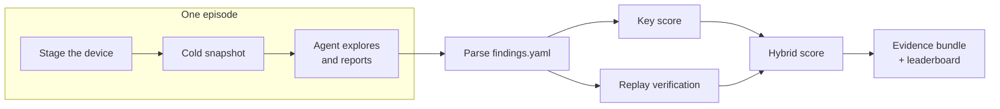
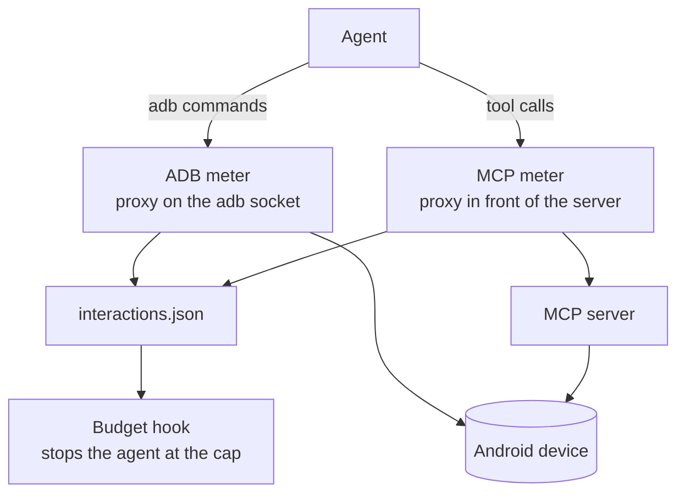
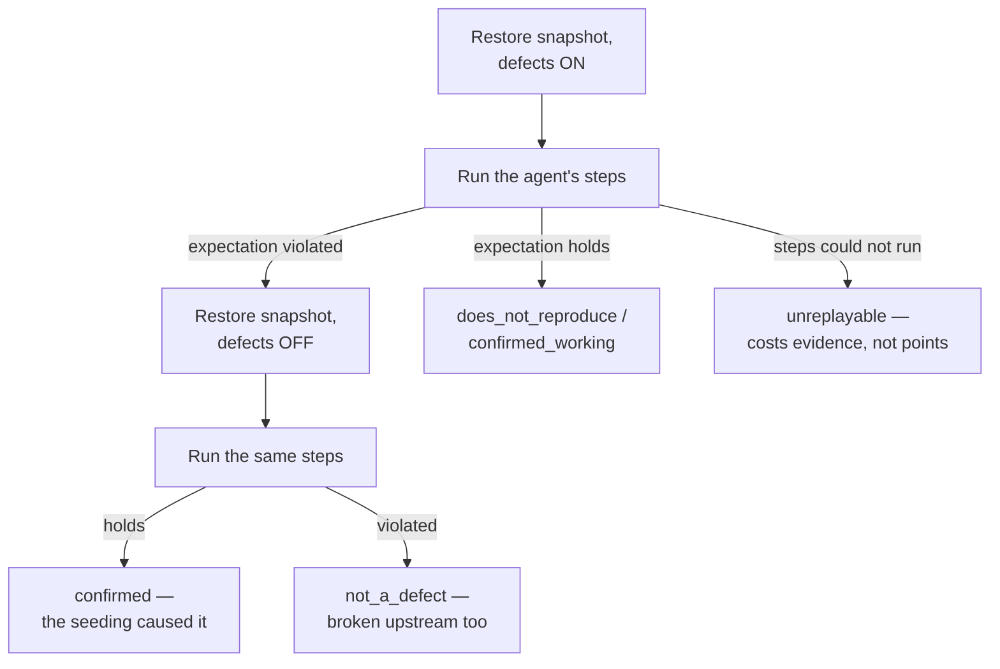

# Architecture — how the benchmark works

QualGentBench answers one question: **how good is a coding agent at real mobile QA?**
To answer it fairly, the harness has to do three jobs: hand every agent the exact same
world, measure the agent's work without trusting the agent, and verify every claim by
re-executing it. This document walks through the machinery that does that.

## The big picture

One **episode** = one agent, one model, one app, one trial. The agent gets a neutral
"sign off on this release" brief listing the app's feature areas — never a hint that
anything is broken. It explores the app on a real device, reports each area as
`as_specified` / `deviates` / `blocked` in `findings.yaml`, and writes a replayable
reproduction for every claim. Then the harness checks its work.

## The apps: real code, seeded defects

Every app is a real open-source Android app rebuilt with known defects patched into
its source. Each patch is gated on a runtime flag, so **one APK serves as both the
clean build and the seeded build** — the harness writes a flags file into the app's
sandbox to choose which defects are live.

Crucially, what counts as "broken" is **derived, never asserted**:
`scripts/derive_truth.py` runs every area's check against the clean flags and the
seeded flags and records what actually differs. Areas a defect breaks incidentally
become `collateral` (never charged either way); areas that work become controls
(a false report there costs points). The spec's `check:` block only says *how to
exercise* an area — the device says whether it works.

## Two arms, one measurement

The same agent can run two ways, and the comparison between them is the point:

- **bare** — no device tools; the agent drives the device through `adb` itself.
- **mcp** — the agent gets device tools from an MCP server you run.

Both arms are measured in the same unit — the **interaction** (one tap, one swipe,
one text entry, one screen read) — by two proxies that sit *below* the agent:

One adb command is one step however the agent batches them: a shell request that chains
several commands is charged for each. The agent cannot see, skip, or influence the meters. Every adapter's step budget is
enforced from the same `interactions.json` file — a rule pinned by a test, so adding
a new agent never means adding a new counter. The hook fails closed: an unreadable
meter stops the episode rather than letting it run unmeasured.

### What each MCP tool costs

On the mcp arm the tool name is the intent, so classification is a lookup in one
table, `interactions.MCP_TOOL_RULES`. The meter charges from it, and the scorers read
the same table: which results are device evidence, and which are reads of the app
(grounding, the screen witness, the screenshot-only exemption). Names match
**exactly**, on the base name (`mcp__device__mobile_tap` → `mobile_tap`), and the only
family is `qg_*` (device-lock plumbing, never charged). Every tool DevLoop-MCP serves
has a row. `tests/test_interactions.py` holds the table against
`tests/fixtures/devloop_tools.json`, DevLoop's `tools/list`, so a new DevLoop tool fails
the suite instead of quietly costing a step. A `mobile_*` name that no row lists (a
server the table has never seen) is charged one `other` and counts as device
evidence, but it is never a read.

Columns: **steps** is what the meter charges, and a tool that does two interactions
costs both. **evidence** says whether the result counts as device text. **read** is
`screen` (the whole screen or tree: it grounds, witnesses and revokes the
screenshot-only exemption), `query` (a targeted read: it grounds and witnesses, but on
its own it does not revoke the exemption) or blank.

| Tool | steps | evidence | read |
|---|---|---|---|
| `mobile_tap`, `mobile_long_press`, `mobile_double_tap`, `mobile_dismiss_dialogs`, `mobile_web_click` | tap | yes | |
| `mobile_tap_and_observe` | tap + observe | yes | screen |
| `mobile_type_text`, `mobile_edit_field`, `mobile_paste_text`, `mobile_web_fill` | type | yes | |
| `mobile_swipe`, `mobile_swipe_coordinates` | swipe | yes | |
| `mobile_press_button` | press | yes | |
| `mobile_launch_app`, `mobile_open_url` | launch | yes | |
| `mobile_setup_app` (install + launch + element list) | launch + observe | yes | screen |
| `mobile_terminate_app` | terminate | yes | |
| `mobile_observe_screen`, `mobile_native_hierarchy`, `mobile_take_screenshot`, `mobile_web_observe` | observe | yes | screen |
| `mobile_await_element`, `mobile_find_views`, `mobile_hit_test` | observe | yes | query |
| `mobile_set_orientation`, `mobile_rotate_gesture`, `mobile_pinch`, `mobile_set_permission`, `mobile_device_logs`, `mobile_crash_logs` | other | yes | |
| `mobile_install_app`, `mobile_uninstall_app`, `mobile_insert_credential`, `mobile_list_apps`, `mobile_get_screen_size`, `mobile_get_orientation`, `mobile_get_permissions`, `mobile_push_media`, `mobile_await_screen_idle` | — | yes | |
| `mobile_visual_baseline`, `mobile_visual_compare`, `mobile_prepare_app_screen_capture`, `mobile_restore_app_screen_capture`, `mobile_get_screen_recording_capabilities`, `mobile_start_synthetic_screen_recording`, `mobile_stop_synthetic_screen_recording` | — | yes | |
| `mobile_js_console_logs`, `mobile_js_debugger_status`, `mobile_js_evaluate`, `mobile_js_network_logs`, `mobile_js_network_request`, `mobile_js_profiler_query`, `mobile_js_profiler_start`, `mobile_js_profiler_stop`, `mobile_js_reload` | — | yes | |
| `mobile_react_component_tree`, `mobile_react_find_component`, `mobile_react_inspect_element`, `mobile_react_profiler_query`, `mobile_react_profiler_start`, `mobile_react_profiler_stop` | — | yes | |
| `mobile_native_profiler_query`, `mobile_native_profiler_start`, `mobile_native_profiler_stop`, `mobile_profiler_combined_report`, `mobile_web_eval`, `mobile_web_list_targets` | — | yes | |
| `mobile_report_result`, `mobile_mark_step`, `mobile_note_anomaly`, `mobile_get_action_log`, `mobile_workspace_info`, `mobile_get_otp`, `mobile_get_otp_number` | — | **no** | |
| `mobile_boot_emulator`, `mobile_boot_simulator`, `mobile_list_avds`, `mobile_list_simulators`, `mobile_list_available_devices`, `qg_*` | — | **no** | |

These rows follow from the step rule. The bare arm pays `input tap` plus `uiautomator
dump` for what `mobile_tap_and_observe` does in one call, so that tool costs two steps
(it cost one TAP before QUA-2775). Rotating, pinching, granting a permission and
reading logcat are each one bare-arm command that classifies `other`, so their MCP
equivalents cost one `other`. A wait whose answer has no content
(`mobile_await_screen_idle`) is the bare arm's host-side `sleep`, which no meter
sees. Bookkeeping tools answer with the agent's own words, so their replies are
never device text: a report cannot ground itself on its own tool result. The
JS/React/WebView diagnostics are free only because no app in the corpus is React
Native or a WebView, so they do nothing here. An app like that has to revisit those
rows before its first board (TODO in `interactions.py`).

## Staging: every agent gets the identical world

Before the agent starts, the harness rebuilds the world from scratch: wipe app data,
re-grant permissions, disable animations, pin the screen to portrait, stage any sample
content the spec declares, write the defect flags, force-stop every other benchmark app,
and send the device HOME, then launch. HOME comes last on purpose. It makes the launcher
the task directly beneath the app, whatever else is installed, so a crash or a Back from
the app's root screen lands on the home screen and never in some other app an agent
would go on testing. Once the app is in front, the harness pins portrait **again**. A pin
written while the launcher is on top does not survive the launch: the launcher hands the
next app the rotation the previous app was stopped in. So the pin that counts is the one
written after the launch. Every replay pass and every journey-derivation pass stages the
same way, through the same helpers. The one exception is the hunt truth derivation's
one-time staging before its snapshot, which does not pin yet (QUA-2737).

Then the key move: **a cold snapshot**. The app is launched once (first-run work
happens — database created, sample data seeded), settled, force-stopped, and its data
is tar'd. Then it is launched again for the agent. Replay later restores that exact
tar and cold-launches the same way — so *agent-start and replay-start are the same
screen by construction*, not by hope.

## Verification: replay, the heart of the benchmark

An agent's claim is only worth what its reproduction can demonstrate. For every
claim, the harness re-executes the agent's steps twice — **defects ON, then defects
OFF** — and classifies from the difference:

No answer key is consulted here — a finding is confirmed because it reproduces and
disappears when the seeding does. That property cuts both ways: an agent that
correctly reports a genuinely broken "control" still gets credit, and a fabricated
finding cannot be confirmed by any amount of confident prose.

The executor is built to be *faithful*, because a replay failure must mean the
reproduction is bad — never that the robot fumbled. The load-bearing rules: anchor
ties between same-label elements break toward the most specific clickable container;
an inconclusive pass retries the *other* candidate, never the identical tap; a
gesture whose next anchor is missing while the screen provably never changed is
re-issued once; keyboard windows are stripped from every screen read (IME chrome is
neither a tap target nor an oracle); and screens that never report idle are read
through a fallback dump that doesn't wait for idle. Every judgment call the executor
makes — candidates chosen, gestures re-issued, overlays auto-dismissed — is recorded
in `replay.json`, so a surprising verdict is diagnosable from the artifact alone.

## Anti-gaming

- **Contamination canary.** Every spec's first line is a unique token. If it ever
  appears in the agent's tool results, the agent read the answer key and the episode
  is void. Every host path the episode touched is classified.
- **Probe gating.** A defect claimed but never exercised on the device (the
  read-the-code shortcut) earns nothing.
- **Adversary gate.** Synthetic agents that spray "everything deviates", guess from
  CRUD priors, or answer without touching the device must all score ≤ 0 before any
  number is quoted (`scripts/adversary_check.py`).
- **Exclusion, not zeros.** An episode killed before reporting, one that never
  reached the device, or a contaminated one is *not a QA result* — it is excluded
  rather than averaged in, so infrastructure failures can't masquerade as agent skill.

## What lands on disk

Each episode leaves a complete audit trail in `runs/<task>/<run>/`: the agent's raw
transcript, its `findings.yaml`, the app-data snapshot, `result.json` with every
metric, `replay.json` with per-claim classifications and executor provenance, and an
`evidence/` bundle — per-step screenshots, a sha256 manifest, and an `index.html`
that lets anyone walk the episode step by step. The scores are recomputable from
artifacts alone: replays can be re-run as the replayer improves, at zero token cost.

## Code map

| Piece | Where |
|---|---|
| CLI (`doctor` / `run` / `show`) | `src/qualgentbench/cli.py` |
| Episode engine (staging, snapshot, agent, evidence) | `episode_runner.py` |
| Step unit + meters + budget hook | `interactions.py`, `adb_meter.py`, `mcp_meter.py` |
| Agent adapters (claude-code, codex, native) | `adapters/` |
| Findings contract + parser | `submission.py` |
| Replay executor + classification | `replay.py`, `verify/` |
| Scorers | `bugs.py` (key), `replay_score.py`, `hybrid_score.py` — see [scoring.md](scoring.md) |
| App specs (defects, controls, probes) | `data/benchmarks/*.yaml` |
| Build / derive-truth / gates | `scripts/` |
