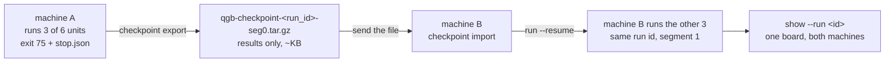

# Checkpointing — hand a half-finished sweep to another machine

A full sweep costs more subscription credit than one account has in a seven-day
window. Checkpointing lets a run **stop on purpose** partway through, travel to
somebody else as one small file, and be finished there **on their credentials** —
under the same run id, so the two sittings score as one run.

Nothing about the sender's account travels. The bundle carries results, not
authentication; see [What is in a bundle](#what-is-in-a-bundle-and-what-is-not).



## The flow

Four commands, and one step that is not a command: step 2 is you sending a file.

### 1. Export, on the machine that ran out

```bash
qualgent-bench checkpoint export <run_id>            # add --runs-dir if not ./runs
```

Writes `./qgb-checkpoint-<run_id>-seg<N>.tar.gz` and prints what is in it. Use
`-o <path>` for a different name or directory.

Any episode that was interrupted — a marker on disk with no `result.json` — is moved
to `runs/_discarded/<run_id>/` **first**, so a partial episode can never ship as a
result. It is moved, not deleted: its transcript is usually the only record of why
the run stopped. Its unit comes back as work the receiving machine owes.

The export **aborts and writes nothing** if any byte it is about to pack looks like a
credential. That is a bug in the run dir, not in the export — see
[the scrub gate](#three-gates-not-one).

### 2. Send the file

Email it, `scp` it, drop it in Slack. It is kilobytes.

> **S3 sharing is deferred.** `checkpoint push` / `pull` against a shared bucket is
> designed but not built, and it will live in the private repo when it is — this
> public repo never depends on AWS. **Today the bundle is shared as a file, by hand.**

### 3. Import, on the machine that will finish it

```bash
qualgent-bench checkpoint import qgb-checkpoint-<run_id>-seg0.tar.gz \
  --runs-dir runs
```

Every member is re-checked against the manifest's sha256, re-checked against the
denylist AND the member allowlist, and re-scanned for credentials before it is
written — the sender's gates are not the receiver's evidence, and the manifest that
lists the members travels inside the same unsigned archive. A member that is not a
run-metadata file of this run or an episode scoring file is refused, as is an episode
whose `result.json` names somebody else's run id. The command prints the exact resume
line to run next.

A run that already exists here with **different** bytes is refused, never merged: two
machines that both ran a unit produced two different answers, and silently keeping
one of them is how a board stops being reproducible. Re-importing the *same* bundle
is a no-op, so a re-send is safe.

### 4. Resume

```bash
qualgent-bench run --resume <run_id>                 # add --runs-dir if not ./runs
```

The resume takes the agent, model, mode, trials and the **frozen unit list** from the
imported `plan.json`. It skips every unit that already has a quotable result, discards
any interrupted episode, and runs the rest under the same run id as the next segment.

- **Scope flags are refused.** `--models`, `--app`, `--tier`, `--mode` and `--trials`
  contradict a resume — the scope is the plan's, and silently ignoring one would run a
  different benchmark than the one asked for. `--devices`, `--lanes`, `--mcp-server`
  and `--runs-dir` may differ, because those are about the machine, not the benchmark.
- **The environment is checked.** Harness version, image digest, and per app the spec
  hash and the APK sha256 are compared against what the run was planned against. A
  mismatch refuses the resume; `--force-resume` accepts it, and then the run id covers
  two different benchmarks — say so when quoting it.
- **An excluded attempt is re-run.** A rate-limited or infra-failed episode measured
  nothing, so its unit is still owed.

### 5. Read one board

```bash
qualgent-bench show --agent claude-code --mode <mode> --run <run_id>
```

One board over both machines' episodes. Rows that arrived in a bundle are counted in
a footer — *"3 of 6 episode(s) imported from a checkpoint bundle … cannot be
re-verified here"* — because their heavy artifacts are still on the machine that ran
them. Their scores are as recorded there; this machine cannot re-derive them.

`checkpoint show <bundle|run_id>` prints the same manifest for a file you have not
unpacked or a run already on disk, with `--json` for the full remaining-unit list.

## What is in a bundle, and what is not

A bundle is **results only**. It is deliberately not a copy of the run dir.

**Packed** — per run, `_runs/<run_id>/{plan.json,schedule.jsonl,board.json}`; per
*completed* episode, `episode.json`, `result.json`, `replay.json`,
`verifier/ctrf.json`, `workspace/findings.yaml`, `instruction_sent.md`,
`interactions.json`, `adb_counts.json`; and `checkpoint.json`, the manifest — run
identity, agent and model, scope, harness version and image digest, counts, the
remaining units, and a sha256 for every packed file. (The *full* environment
fingerprint, including per-app spec and APK hashes, rides in the packed `plan.json`;
that is what the resume compatibility check reads.)

**Never packed** — `claude_home/`, `codex_home/` (these hold live OAuth
credentials), `agent/transcript.txt`, `evidence/`, `hooks/`, `app_snapshot.tar`,
`mcp_config.json`, `settings.json`, any `.env`, and the run-level `rate_limit.json`
and `stop.json` (the sender's account state and the sender's reason for stopping —
neither is a result). Interrupted episodes are not in a bundle at all.

### Why authentication is never in one

The point of the feature is that the person who finishes the run does it **on their
own account**. A bundle that carried the sender's token would defeat that and leak a
credential in the same move. So the exclusion is structural, not a habit:

#### Three gates, not one

1. **Denylist, by path.** Every candidate is checked by the path itself, not by a
   list of what to include. A file is refused for *where* it is, so it stays refused
   even if someone later widens what gets collected or globs a directory. Directory
   names match on any path component, so a nested `workspace/claude_home/` is caught
   as well as a top-level one, and the comparison is **casefolded** — `CLAUDE_HOME/`
   and `.ENV` are the same paths as the denied ones on macOS and Windows.
2. **Member allowlist, by shape.** A bundle may carry exactly two kinds of path:
   `_runs/<this run id>/{plan.json,schedule.jsonl,board.json}`, and
   `<task_id>/<episode dir>/<episode scoring file>` at exactly that depth. Anything
   else — a script three levels down, a dotfile at the runs root, another run's
   metadata — is refused. Export satisfies this by construction; import **checks** it,
   because the manifest vouching for an incoming member ships inside the same unsigned
   archive.
3. **Scrub gate, by content.** Every byte that would be written is scanned first for
   every credential the design doc names as in play — `sk-ant-`, `sk-`,
   `CLAUDE_CODE_OAUTH_TOKEN`, `ANTHROPIC_`, `OPENAI_`, `FIREWORKS_`, `CODEX_`,
   `HF_TOKEN`, `QUALGENT_SHEET_`, `ANDROID_EMULATOR_CONSOLE_AUTH_TOKEN` — plus the
   generic shapes a pasted `env` dump or curl command carries: `Bearer `/`bearer `,
   `accessToken`/`refreshToken` and their snake_case spellings, PEM private-key
   headers, and AWS key ids and key names. One hit aborts the whole export, naming the
   file and line. The archive is built at a temp path and renamed only after the last
   file passes, so a refused export leaves nothing behind.

   The file that leaks is usually not one a path rule can reach: `workspace/findings.yaml`
   is written by the agent and is legitimately on the allowlist, so content is the only
   gate in front of it.

   Bare `sk-` requires a token boundary in front of it, because ordinary benchmark ids
   contain the substring — the seeded bug `task-completion-not-persisted` is one, and
   it appears in `result.json`, `instruction_sent.md` and `findings.yaml`. An
   unanchored match would abort every export of those apps and turn the gate into
   something people route around. `sk-ant-` is matched unanchored regardless, so an
   Anthropic key is caught however it is embedded.

All three gates run again on **import**, on `checkpoint.json` as well as on the
members. A bundle arrives from another machine; its sender's gates are not this
machine's evidence.

`"we only listed the safe files"` is a promise that decays the first time someone adds
a filename. Three independent gates is the design.

### Verify it yourself

```bash
tar -tzvf qgb-checkpoint-<run_id>-seg0.tar.gz          # what is in it
tar -xzOf qgb-checkpoint-<run_id>-seg0.tar.gz | grep -nE \
  'sk-ant-|sk-proj-|CLAUDE_CODE_OAUTH_TOKEN|ANTHROPIC_|Bearer |refreshToken|accessToken'
```

The second command should print nothing. A bundle is small by construction — a few KB
per completed episode. A real run dir is orders of magnitude larger, and the whole
difference is the evidence, snapshots, transcripts and config homes that stay home.

## Stopping on purpose: the credit guard

Claude Code on **subscription (OAuth) auth** reports its own usage windows on the
`stream-json` output the adapter already pumps. The guard reads them between units —
never mid-episode, so an episode in flight is finished and scored rather than thrown
away.

The two windows mean different things, and conflating them is the mistake the design
exists to prevent:

| Window | What it is | What happens |
|---|---|---|
| **seven-day** | the budget the sweep is spending | past the threshold the run stops **for good**: export and hand it over. Nobody waits out a seven-day reset. |
| **five-hour** | a short block | never a reason to abandon a sweep: the run stops only so the **launcher** can wait for the reset and resume the same run id. |

Seven-day always outranks five-hour. Waiting five hours puts no credit back into a
spent seven-day window.

### Config keys

In `bench.config.yaml`:

```yaml
checkpoint:
  stop_at_seven_day_pct: 100      # 1-100. 100 = only when the window is spent (default).
  wait_for_five_hour_reset: true  # read by scripts/launch.py.
```

- **`checkpoint.stop_at_seven_day_pct`** — stop the sweep once the seven-day window
  reaches this **percentage**. Note the units: the provider reports a `0-1` fraction,
  this key is `1-100`. The default `100` means "only when the window is spent", i.e.
  off unless you ask for it. Set it to e.g. `85` to stop with credit to spare.
  Overridden by `--stop-at-seven-day-pct`, or the `QGB_STOP_AT_7D_PCT` environment
  variable. **`0` is refused**, on the config, the flag and the env var: it reads as
  "off" but means "stop at 0% used", which stops a healthy run before its first
  episode. `100` is how you say off.
- **`checkpoint.wait_for_five_hour_reset`** — whether the **launcher** sits out a
  five-hour block and resumes, or hands back and stops. The harness itself stops
  either way; nothing inside one `run` invocation ever sleeps for hours. The value is
  copied into `stop.json` so the launcher reads the run's own answer, not its own.

Both keys are inert unless the agent reports usage windows. On `ANTHROPIC_API_KEY`
auth, or a Fireworks-routed model, the stream carries no windows at all and preflight
says so:

```
credit guard inactive (no subscription windows) — ANTHROPIC_API_KEY auth emits no
rate_limit_event; run on CLAUDE_CODE_OAUTH_TOKEN to stop the sweep on a seven-day
threshold
```

### Exit codes

`run` has three, and the third is the whole protocol:

| Code | Meaning | What to do |
|---|---|---|
| **0** | the run finished, or `--resume` found nothing left to do | read the board |
| **75** | *stopped on purpose, resumable.* The credit guard froze the queue at a unit boundary. In-flight episodes were finished and scored, the board was written, and `stop.json` says why. | read `stop.json` — wait and `--resume`, or `export` and hand over |
| **1** | the run broke — a bad config, a dead device, an unreadable plan | fix the cause. No `stop.json` is written, so the launcher will not auto-resume; the episodes already scored are still on disk, so `--resume <run_id>` by hand still works once it is fixed |

75 is `EX_TEMPFAIL`. It is a contract, not an implementation detail: it is the one
thing the launcher loop branches on, and a wrapper of your own should branch on it
too. **Do not retry a 75 blind** — without reading `stop.json` you cannot tell a
five-hour wait from a seven-day hand-off, and retrying the latter just burns the
first unit against a spent window.

### The `stop.json` contract

Written to `<runs_dir>/_runs/<run_id>/stop.json` **only** when the guard stopped the
run. A run that finished, was cancelled or errored leaves no stop file, so *"does this
file exist"* is itself the signal. Exit 75 always accompanies it.

Common keys (a schema sketch, not a literal file — `reason` is one of the two):

```
{"schema_version": 1,
 "run_id": "20260909-120000-a1b2",
 "reason": "seven_day_threshold" | "five_hour_limit",
 "stopped_at": "2026-09-09T12:34:56+00:00",
 "wait_for_five_hour_reset": true,
 "done": 12, "remaining": 30,
 "resume": "qualgent-bench run --resume 20260909-120000-a1b2"}
```

`done` and `remaining` count **units of the run**, read off the plan and the results —
not episodes of this sitting.

**`reason: "seven_day_threshold"`** adds `utilization` (the raw `0-1` fraction),
`utilization_pct`, `threshold_pct`, `resets_at` (unix epoch seconds, may be null) and
`rejected` (`true` when the provider refused outright rather than the configured
threshold being crossed). **The launcher must not wait on this reason** — a seven-day
window is days from resetting. Export and hand over.

**`reason: "five_hour_limit"`** adds `resume_after` (unix epoch seconds, may be null)
and `rate_limit_type`. Wait until `resume_after`, then re-run with `--resume <run_id>`.

## The launcher loop

`scripts/launch.py` owns the emulators, so it owns the wait. A segment that exits 75
is inspected, not retried blind:

- `five_hour_limit` **and** `wait_for_five_hour_reset` — tear the emulators down,
  sleep past `resume_after` (+60s margin, capped at 6h), boot them again, re-run with
  `--resume <run_id>`. Up to 10 segments per launch.
- `seven_day_threshold`, or waiting turned off, or no readable `stop.json`, or a
  `stop.json` naming a different run — print the hand-off commands and exit. Nothing
  is lost either way.

`--no-auto-resume` restores the old single-shot behaviour.

> **The launcher now always passes `--run-id-file`.** It is how the host learns the
> run id the container generated, so it can build `--resume` for the next segment —
> and it is passed on the first segment too, before anything can fail. That flag does
> not exist in older harnesses, so **`scripts/launch.py` needs an image built from
> this branch**: `docker build -t qualgentbench:local .` (or `make image`) after
> pulling. Against an older image the first segment dies immediately on an unknown
> option.

## What a live hand-off still has to prove

Everything above is covered offline by `tests/test_checkpoint_handoff.py`, which
exports, imports into a second runs dir and resumes there against a stubbed corpus and
a fake lane engine — no device, no agent, no credits. That test pins the *mechanism*:
the discard, the denylist, the scrub gate, the unchanged run id, the units scheduled,
the blended board.

It cannot pin anything that only a real provider and a real device produce. **These
steps still need a human with subscription credits and an emulator**, and are
deliberately not automated — they spend scarce credit:

1. **The guard actually firing mid-sweep.** Synthetic `rate_limit_event` lines are
   what the unit tests feed the parser; nobody has yet watched a real sweep cross the
   threshold and stop itself.

   ```bash
   # Set the threshold just ABOVE current seven-day utilization so it fires mid-sweep.
   uv run qualgent-bench run --agent claude-code --models claude-opus-4-8 \
     --tier easy --app birday --mode hunt --trials 2 \
     --devices emulator-5554 --stop-at-seven-day-pct <just-above-current> --yes
   echo "exit: $?"                             # expect 75
   cat runs/_runs/<run_id>/stop.json           # expect reason: seven_day_threshold
   ls runs/_discarded/<run_id>/                # expect the interrupted episode
   ```

2. **A real `.env`-to-`.env` hand-off.** The offline test uses two runs dirs in one
   process; it does not prove the bundle survives a second machine with different
   credentials and a different checkout.

   ```bash
   # machine A
   uv run qualgent-bench checkpoint export <run_id>
   tar -tzvf qgb-checkpoint-<run_id>-seg0.tar.gz          # attach this listing
   # → send the file to machine B (different .env, different account)
   # machine B
   uv run qualgent-bench checkpoint import qgb-checkpoint-<run_id>-seg0.tar.gz
   uv run qualgent-bench run --resume <run_id>
   uv run qualgent-bench show --agent claude-code --mode hunt --run <run_id>
   ```

   Confirm: same run id on both, only the remaining units run on B, and both
   `_runs/<run_id>/schedule.jsonl` files show the `resume` event with `segment: 1`.

3. **`claude -p` behaviour on a five-hour `rejected`.** **UNVERIFIED.** The design
   assumes the runner must detect the rejection and kill the process, because it is
   not known whether print-mode exits or blocks. The adapter kills it either way, so
   the guard is safe under both — but if print mode *blocks silently* without emitting
   the event, a watchdog on the age of the last stream event would be needed. Record
   what actually happens the first time a five-hour reset is observed naturally, and
   update this section and the guard.

4. **The launcher's wait-and-resume across a real reset.** The loop is unit-tested
   against a fake docker; sleeping out a real five-hour window, rebooting real AVDs
   and resuming has not been done end to end.

   ```bash
   make image                                   # required: --run-id-file is new
   uv run scripts/launch.py bench.config.yaml   # with wait_for_five_hour_reset: true
   ```
