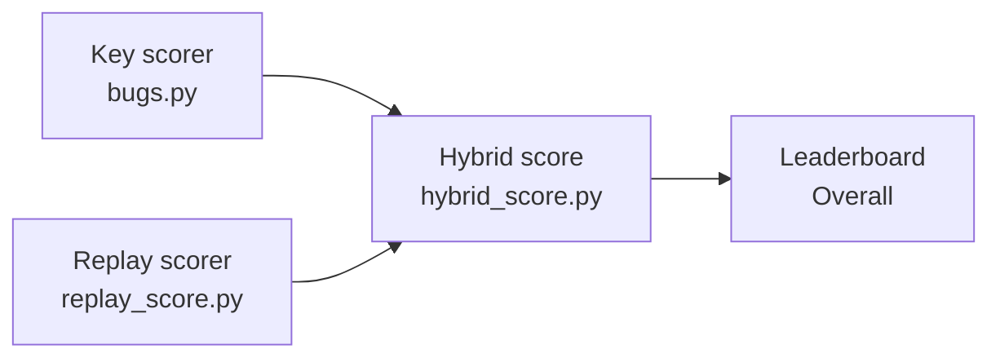

# Scoring — every formula, and why it is shaped that way

The published score is the **hybrid** one: detection comes from the verified answer
key, false positives come from replay, and a claim the agent could not demonstrate
earns half credit. This page walks through all three layers bottom-up, with the
exact constants from the code.



## The constants

| Constant | Value | Meaning |
|---|---|---|
| Tier weights `W(tier)` | L1=1, L2=3, L3=6, L4=10 | hunt/guided recall weighting (untier'd = 1). A **house convention**, not derived from any published severity scale; journey mode does not use it — see [Journey mode](#journey-mode--rates-not-weights) |
| `SPEED_WEIGHT` | 0.035 | the whole speed effect, bounded below the smallest quality gap |
| `HUNT_FP_PENALTY` | 0.25 | cost of one false report in hunt mode |
| `UNDEMONSTRATED_CREDIT` | 0.5 | credit for a correct claim with no working reproduction |
| `EFFICIENCY_FLOOR` | 0.5 | guided mode: a slow correct find keeps at least half its weight |
| `FP_PENALTY` (guided) | 3.0 | ≈ the median bug weight |
| `MIN_CALLS_PER_CLAIM` | 3 | device work required between banked verdicts |

## Layer 1 — the key scorer (hunt mode)

Per episode, against the app's seeded-defect list:

**Recall is tier-weighted; precision is count-based.** A hard bug is worth more to
find, but every false report costs one triage cycle regardless of the feature:

```
recall    = Σ W(tier) over found defects / Σ W(tier) over all seeded defects
precision = tp / (tp + fp)
F1        = 2 · precision · recall / (precision + recall)
```

A defect only counts as *found* if the agent reported the area broken **and**
exercised it on the device (probe keywords must appear in its device output).
Claimed-but-never-touched earns nothing.

**Speed is a discount, never a bonus.** Ranking must stay quality-first, so the
speed term lives in `[1 − 0.035, 1]` — smaller than any single tier-weight gap:

```
earliness    = clamp(1 − steps/budget, 0, 1)          # steps = enforced interactions
speed_factor = 1 − 0.035 · (1 − earliness)            # ∈ [0.965, 1.0]
```

Speed credit is *earned*: it applies only when at least one find was probe-verified.
Zero recorded steps takes the full discount — a missing measurement never wins.

**Overall:**

```
overall_raw = recall · speed_factor − 0.25 · fp      # can go negative
overall     = max(0, overall_raw)                    # the reported number
```

Ranking uses the signed `overall_raw`, so spraying "everything deviates" lands
*below* honest silence, not tied with it.

**Guided mode** (one task per bug) uses the same weights differently:

```
reward(bug)  = W(tier) · correct · efficiency
efficiency   = clamp(ref_steps / actual_steps, 0.5, 1)
speed bonus  = 1 + 0.035 · earliness                  # pure tie-breaker
FP penalty   = 3.0 per false report
```

## Layer 2 — the replay scorer

Replay classifies every claim by running its reproduction with the defects ON and
OFF (see [architecture.md](architecture.md)). The scorer turns classifications into
counts, with three deliberate asymmetries:

1. **UNREPLAYABLE costs the benchmark information, never the agent points** — with
   one exception. A defect claim on an area *measured to work*, whose reproduction
   cannot run at all, is a false report (otherwise "claim everything with junk
   repros" would earn full recall and zero FPs).
2. **A failed repro on a derived-broken area is a weak reproduction, not a false
   positive** — the agent was right about the area, only its evidence failed.
3. **An area with no derived label cannot be adjudicated** — reported, not charged.

```
recall    = confirmed / seeded_total
precision = confirmed / (confirmed + false_positives)     # unreplayable excluded
trust     = replayed claims / claims that could be replayed
```

`trust` is how much of the episode's score was *executed* rather than believed. It
is published beside every score and never folded into it.

## Layer 3 — the hybrid score (what the leaderboard shows)

Detection from the key (which knows every seeded defect), false positives from
replay (which excludes weak reproductions) — each source covers the other's blind
spot. A defect the agent claimed but could not demonstrate moves from full credit to
half:

```
credited  = found + 0.5 · unverified
recall    = min(1, credited / seeded)
precision = credited / (credited + false_positives)
F1        = 2 · precision · recall / (precision + recall)
fp_rate   = false_positives / controls
speed     = 1 − 0.035 · min(steps/budget, 1)
overall   = max(0, recall · speed − 0.25 · false_positives)
```

This is the line the console prints per app and the board averages per model.

## Worked example

An app seeds 3 defects (all L1) with 5 working controls, budget 100. The agent finds
all 3, demonstrates 2 on replay, files 1 false report, and spends 60 steps:

```
credited = 2 + 0.5·1        = 2.5
recall   = 2.5 / 3          = 0.833
precision= 2.5 / (2.5 + 1)  = 0.714
speed    = 1 − 0.035·0.6    = 0.979
overall  = 0.833·0.979 − 0.25·1 = 0.566   → 56.6%
```

Had the third reproduction replayed, overall would be 72.9%; had the false report
also not been filed, 97.9%. Both gaps dwarf the speed term's entire range (3.5
points) — demonstrability and precision outweigh speed by design.

## What is excluded, not zeroed

`env_failure` (killed before reporting), `infra_failure` (never reached the device),
and `contaminated` (read the answer key) are **not QA results** — they are excluded
from every average rather than scored as zero. Excluding a *weak* episode would
invert the incentive (deleting the evidence deletes the failure), so a weak
reproduction is always a scored, penalized QA result — exclusion is reserved for
episodes that never happened in any meaningful sense.

## Journey mode — rates, not weights

Journey episodes (one test case, clean or seeded build) publish **completion** and
**bug finding** separately, and bug finding is unweighted: `recall = found / present`,
`precision = found / (found + false reports)`, one F1 from the totals. No tier
weights — 1/3/6/10 is a house convention we should not imply is derived from anything.
The severity-aware number is **blocker recall**, reported on its own.

Under the ranking table the board prints a **Rates** block (`rates.py`), each rate as
`k/n p% [lo–hi]` with a 95% Wilson interval. The denominators are where these numbers
would lie, so they are fixed here:

```
false_alarm_rate  = clean EPISODES with ≥ 1 false report / clean episodes
                    (per episode, not per report; every non-excluded clean episode,
                    including ones whose completion was unscored or truncated;
                    seeded-arm false reports are precision's problem, not this one's)
catch_rate        = seeded DEFECTS found / seeded defects present
                    (per defect: a case with one functional and two display bugs is 3)
clean_integrity_N = (1 − false_alarm_rate)^N       published at the fixed N = 200
                    interval: ((1 − hi)^N, (1 − lo)^N) — high alarm rate, low integrity
blocker_recall    = found / present over FUNCTIONAL defects in tiers L4 and L3
                    (display defects never block; None when none were seeded, never 0/0)
projection(N_clean, N_seeded):
    expected_false_alarms = false_alarm_rate × N_clean
    expected_misses       = (1 − catch_rate) × N_seeded
    clean_run_integrity   = (1 − false_alarm_rate)^N_clean
    expected_errors       = expected_false_alarms + expected_misses
                            (the prior-weighted cost line: a point, never a ranking key)
```

Why 200 and why single digits: a nightly suite of 200 clean cases should come back
clean most nights. At a 1% per-case false-alarm rate that is 0.99^200 = 13% clean
nights already; at the 10–22% we measure today it is zero. Industrial static analysis
settled in the same place (Tricorder aimed under 10% and reached ~5%; Coverity saw
20–30% abandonment).

Power counts **distinct cases**, not trials: ~200 cases for ±5pp at 15%, ~450 for ±2pp
at 5%. The intervals treat every episode as an independent draw, so five cases × three
trials print a narrower bracket than the evidence supports.

**Ranking** (QUA-2780, `journey.ranking_key`): the journey table ranks within each
block (public, then held-out) on

```
(heldout, −clean_integrity_200, −catch_rate, −F1)
```

F1 is computed at a 50% bug prior — every case has a clean and a seeded arm — while a
real suite runs at a few percent, where the false-alarm rate is what a team pays for.
Integrity is compared through the unrounded false-alarm rate (same order, since
(1 − p)^200 is strictly decreasing in p): the stored `clean_integrity_200` is rounded to
four places and every rate above ~5% rounds to 0, which would tie every row measured
today. A row with no clean episode (no integrity) ranks below every row with one; a row
with no seeded defect ranks below every row with a catch rate at equal integrity. F1 and
completion stay displayed; completion never ranks, because it is partly unscored by
design. None of the rates is blended into another.

**Cost and time per episode** are columns of the table and fields of every
`journey.summary` row: `cost_per_episode` is the MEAN `cost_usd` over the priced
episodes (`cost_priced`), with `cost_unpriced` beside it — an unpriced episode (model not
in `pricing.PRICING`, or no usage reached the harness) is counted, never averaged in as
$0, and a row with no priced episode prints `—` and the count; `minutes_per_episode` is
the MEDIAN agent wall-clock (`wall_time_sec`: the agent alone, not staging or
verification). `scripts/rescore_journey.py --dry-run --projection 200 50` prints the
same cells, the Rates block and a projection — including the prior-weighted error count
for that suite — for saved runs without writing anything.

## Sanity gates on the whole scheme

Before quoting a number: `scripts/adversary_check.py` runs synthetic spray / prior /
oracle agents through the real scorers and requires every guesser ≤ 0 while the
honest agent scores near 1; `scripts/check_tier_ready.py` verifies budgets, briefs,
and tier weights resolve for every app. If the constants above ever change, those
gates are what catch a scheme that a guesser can beat.
